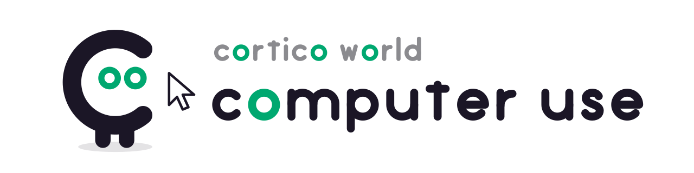

<!-- Owner: src/definition.ts -->

<p align="center">
  <picture>
    <source media="(prefers-color-scheme: dark)" srcset="assets/banner-dark.svg">
    
  </picture>
</p>

[Cortico](https://github.com/Pal-AI-Lab/Cortico) 的电脑操作 World,一个独立的扩展包:bot 看得见这台电脑(Windows 或 macOS)的主屏幕,
能移动和点击鼠标、滚动、打字、按组合键、列出和切换窗口。使用者一动鼠标键盘,操作就让位。
[Coopanion](https://github.com/Pal-AI-Lab/Coopanion) 用它让 Coo 帮你操作电脑。

## 工具

坐标一律是最近一张截图的像素;截图缩放到 `screenshot.maxWidth`×`maxHeight`(默认 1280×800)以内,画上鼠标指针,JPEG 编码。

| 工具 | 作用 |
|---|---|
| `cua_screenshot` | 截主屏幕;回执带屏幕与截图尺寸、指针位置、前台窗口标题 |
| `cua_click(x, y, button, clicks)` | 左/右/中键,单击、双击、三击 |
| `cua_move(x, y)` | 只移动,用于悬停 |
| `cua_drag(from, to)` | 按住左键拖动 |
| `cua_scroll(x, y, down, right)` | 在某处转滚轮,单位是格 |
| `cua_type(text)` | 按 Unicode 字符打字,与键盘布局和输入法状态无关;`\n` 按回车 |
| `cua_key(keys)` | `"ctrl+s"`、`"alt+f4"`、`"ctrl+a delete"`:`+` 同时按,空格分先后 |
| `cua_windows` | 可见顶层窗口的标题、位置(截图坐标)、是否最小化、前台 |
| `cua_focus(window)` | 按句柄或标题片段切到前台,最小化的先还原 |
| `cua_wait(seconds)` | 等一会儿再截图 |

操作类工具默认做完等 `screenshot.settleMs`(500 ms)再附一张截图;参数 `screenshot: false` 可以省掉。

## 每一轮先问

bot 每一轮第一次截图、列窗口或发输入之前,先问使用者这一次能不能用电脑;没同意(拒绝、关掉或 60 秒没回应),
这一轮剩下的调用都不执行,回执写明原因,下一轮再用时重新问。参数不合法的调用在问之前就被拒掉。

怎么问由内嵌应用决定:`cuaDefinition({ askPermission })` 传入一个函数(比如用桌宠的气泡问),返回 `yes` / `no` / `timeout`,
返回 `null` 表示此刻问不了。没传或返回 `null` 时,弹一个置顶的系统对话框(Windows 上是 `MessageBoxTimeoutW`,macOS 上是 AppleScript 的 `display dialog`)。

## 让位给使用者

发出任何输入前,引擎先确认使用者已经静止 `userIdleMs`(默认 2 秒)。「使用者动过」的依据是两条可以核实的事实:
系统记录的最后一次输入晚于引擎自己的最后一次注入(Windows 的 `GetLastInputInfo`,macOS 的 `CGEventSourceSecondsSinceLastEventType`),或者鼠标指针不在引擎上次放下的位置。
等满 `maxYieldWaitMs`(默认 15 秒)使用者还在用,这次操作不执行,回执照实说明。打字按 16 个字符一段发送,
每段之间再检查一次,使用者一动就停,回执报告实际打出了几个字。

`control` 关掉后只能截图和列窗口,所有输入工具返回拒绝原因。

登录、密码、验证码、支付交还给使用者,以及发送、删除、提交、购买前先问,这些写在环境提示词 `src/ENV_PROMPT.md` 里。

## 实现

操作系统调用都在引擎子进程(`src/engine-child.ts`)里,经 [koffi](https://koffi.dev/) 直接调系统接口,坐标都是主屏幕的物理像素。
子进程崩溃只让在途的那次调用失败,下次调用重新拉起。

- Windows(`src/engine/win32.ts`):GDI `BitBlt`(带 `CAPTUREBLT`,透明与分层窗口也截得到)、`SendInput`、`EnumWindows`、
  `GetLastInputInfo`;子进程声明为 per-monitor DPI aware(v2)。
- macOS(`src/engine/darwin.ts`):系统自带的 `screencapture` 截图;鼠标键盘是 CoreGraphics 的 `CGEventPost`
  (坐标按屏幕的缩放比从像素换成点,双击靠事件里的点击计数);窗口表来自 `CGWindowListCopyWindowInfo`;
  切到某个窗口所属的应用、弹确认框用 AppleScript。`cua_key` 里的 `cmd` 是 Command 键。
  macOS 要在「系统设置 → 隐私与安全性」里给应用两项权限:「录屏与系统录音」(截图、读窗口标题)和「辅助功能」(鼠标键盘);
  第一次用时系统会问,没给之前工具回执写明去哪里打开。切换应用时 System Events 还会问一次能不能被控制。

只支持 Windows 和 macOS 的主屏幕;在别的系统上启用会被 `preflight` 拒绝。

## 安装

在 Cortico 控制台「扩展」页安装(填本目录的绝对路径),整进程重启后在「World 总览」启用,
或在 bot 的 `declares` 里加 `cua`。没有自定义面板,配置项在 World 页的配置里。

## 测试

```bash
corepack pnpm test        # 单元测试:按键解析、缩放与编码、参数校验、干装载
corepack pnpm test:e2e    # 端到端:会在这台电脑上真的移动鼠标、打字
```

端到端测试打开一个置顶的 WinForms 窗口(`tests/e2e/target-form.ps1`),它把控件的屏幕坐标和收到的输入打印出来:

- `desktop.test.ts`:截图里洋红色块出现在窗口自报的位置;点进输入框打「hello 桌宠 123」再点按钮提交;组合键;
  滚动列表;列窗口与切前台;外部移动鼠标时先让位;`control` 关闭时拒绝;越界坐标拒绝。
- `core.test.ts`:经过 Cortico Core 的完整一轮。一个事件唤醒 bot,脚本扮演的模型先截图,确认工具结果里带着
  `image/jpeg` 附件,再点击、打字、提交;窗口收到的文本与模型发出的一致。除了模型,其余都是真组件。

`tsconfig.json` 与 vitest 配置把 `cortico/*` 指到同级的框架 checkout(`../BOT/src/`)。
